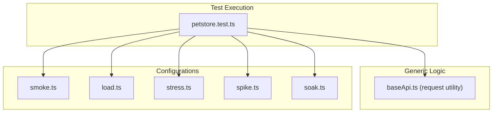

# 🚀 Generic k6 Performance Framework

A production-grade, highly scalable performance testing framework built with **k6**, **TypeScript**, and **Webpack**. Engineered for maximum reusability across multiple APIs using a generic abstraction layer.

---

## 🏗️ Technical Architecture

This framework decouples API logic from performance test orchestration using a **Generic Request Layer**.



---

## 📋 Prerequisites

- **Node.js** v20.x+
- **pnpm** v10.x+
- **k6** v0.50.0+ (Must be in System PATH)

---

## 📦 Installation

```bash
pnpm install
cp .env.example .env
```

> [!IMPORTANT]
> Never commit your `.env` file to the repository. It is ignored by default.

---

## 💻 Running Locally

### 1. Build and Run
Tests automatically bundle TypeScript before running.

```bash
pnpm run test:smoke    # Baseline verification (1 VU)
pnpm run test:load     # Ramping load (20 VUs)
pnpm run test:stress   # Breaking point (50 VUs)
pnpm run test:spike    # Extreme burst (100 VUs)
pnpm run test:soak     # Stability test (10 VUs / 5m)
```

### 2. View Local Reports
Local reports are generated in `/reports/k6/<profile>/`. Unlike many projects, these reports are **tracked by Git** in this repository to maintain a local execution history.

---

## 🐳 Running within Docker

If you do not have k6 installed locally, you can use the containerized execution path.

### 1. Build the Image
```bash
pnpm run docker:build
```

### 2. Run Profiles
```bash
pnpm run docker:smoke    # Run single profile
pnpm run docker:all      # Run all 5 profiles sequentially
```

### 3. Sync Traceability (Host)
Since reporting is mapped to your local folder, you can synchronize the SQA matrix on your host machine after the Docker run:
```bash
node scripts/run-test.js smoke --sync-only
```

---

## 🔄 CI/CD Integration

The [GitHub Actions Workflow](.github/workflows/k6.yml) executes on every push to the `main` branch.

### Execution Profiles
- **Smoke Stage**: Validates framework health.
- **Load Stage**: Validates performance targets for p95 latency and error rates.

### 📊 Viewing CI Reports
1. Navigate to the **Actions** tab in GitHub.
2. Select the specific workflow run.
3. Scroll down to the **Artifacts** section.
4. Download `performance-reports-and-sqa-plan` to view the HTML/JSON summaries.

---

## 🧪 Test Case Traceability

Formal test documentation is maintained at:
- **[TEST_CASES.csv](test-cases/TEST_CASES.csv)**: Contains Scenario IDs, Steps, and Status mapping for both functional and performance requirements.

---

## ⚠️ Known Limitations & Assumptions

- **Version Persistence**: The framework assumes a domain-only `BASE_URL`; version prefixes (like `/v2`) must be defined explicitly in the test script endpoints to prevent version mismatch issues.
- **Environment Dependency**: Requires a valid `BASE_URL` in the environment or `.env` file to resolve endpoints.
- **Thresholds**: SLI targets are hardcoded in the configuration files and may need adjustment based on environment capacity.

---

<div align="center">
  <sub>Engineered for 100% Scalability and Observability.</sub>
</div>
